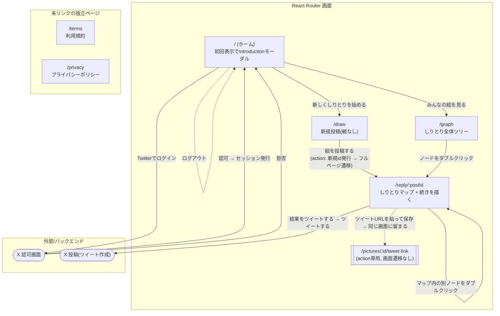

# 画面遷移図

`app/routes.ts` と各画面のリンク/アクション実装から起こした現状の画面遷移図。

- ヘッダー(ログイン/ログアウト導線)は `app/root.tsx` の共通レイアウトとして全画面に表示される。図が煩雑になるため、ログイン/ログアウトの矢印はHomeからのみ代表して描いているが、実際はどの画面からも実行できる。
- `/terms`・`/privacy` はアプリ内のどこからもリンクされていない(URL直打ちでのみ到達する)独立ページ。
- `/pictures/:id/tweet-link` はUIを持たないリソースルート(action専用)。ツイートURLを貼って保存する際に`fetcher.submit`で叩かれるだけで、画面遷移は発生しない。

## 補足: 画面内の主な状態

- **Home**: 初回表示で `Introduction` モーダル(サービス説明 + ログインCTA)が自動的に開く(`useState(true)`)。閉じると背後のナビゲーションのみ操作可能になる。
- **Draw / Reply**: 同じコンポーネント(`app/routes/draw.tsx`)を異なるルートID(`draw-new` / `draw-reply`)で登録している。投稿完了後は React Router のクライアント遷移ではなく `window.location.href` によるフルページ遷移で `/reply/:newId` に移動する(クライアント遷移だとloaderDataが正しく再取得されない実装上の制約のため)。
- **Reply**: `/reply/:postId` はツイートで共有されるURLでもあるため、常に「しりとりマップ(全体ツリーの中で該当の絵にフォーカス→ズームアウト)」「結果をツイートするボタン」「続きを描くフォーム」が1画面にまとまっている。
- **Graph**: `/reply/:postId` と同じ `Graph` コンポーネントを、対象を絞らず全ノード表示する形で使う。
